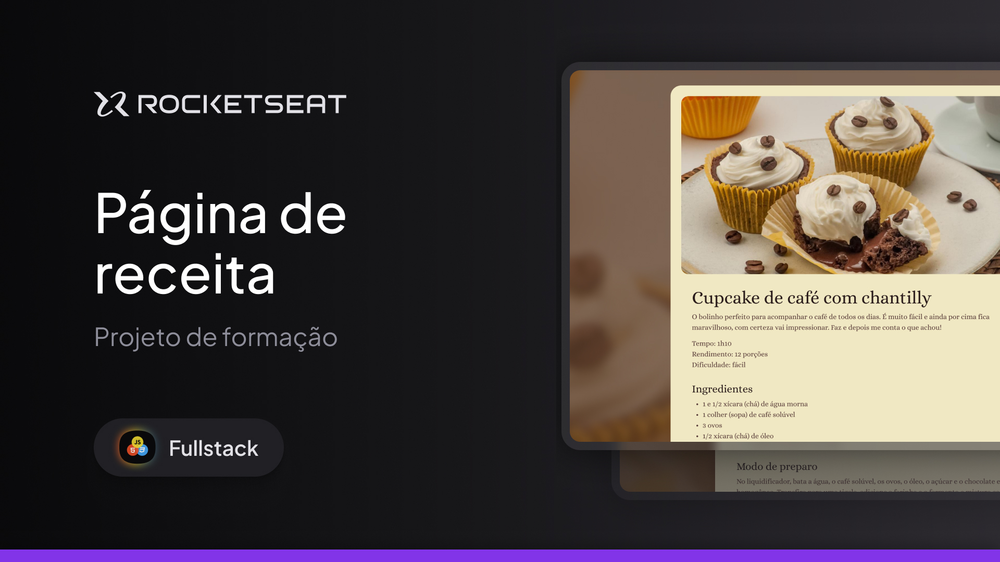

<h1 align="center"> Página de Receitas </h1>

Programa de formação em FullStack promovido pela Rocketseat!
<a href="https://www.rocketseat.com.br/formacao/fullstack?utm_source=google&utm_medium=cpc&utm_campaign=venda&utm_term=perpetuo&utm_content=publicofrio-venda-formacao_fullstack-texto-venda-kw-none-none-fullstack-sitelink-none-br-search&gad_source=1&gclid=Cj0KCQjw7dm-BhCoARIsALFk4v_G-ieHaC--a0VGvdyVlTsjDcLd0QYNnBs1-ZYDjZch25NgDo2Hw0gaAkBgEALw_wcB">Estude essa trilha e muitas outras clicando aqui.</a>

  <a href="#-tecnologias">Tecnologias</a>&nbsp;&nbsp;&nbsp;|&nbsp;&nbsp;&nbsp;
  <a href="#-projeto">Projeto</a>&nbsp;&nbsp;&nbsp;|&nbsp;&nbsp;&nbsp;

 

  

## 🚀 Tecnologias

Esse projeto foi desenvolvido com as seguintes tecnologias:

- HTML e CSS
- Git e Github
- Figma

## 💻 Projeto

O projeto foi desenvolver uma landing page básica de uma receita de cupcake.

- [Acesse o projeto finalizado, online](https://github.com/itsjrsouza/cakerecipe)